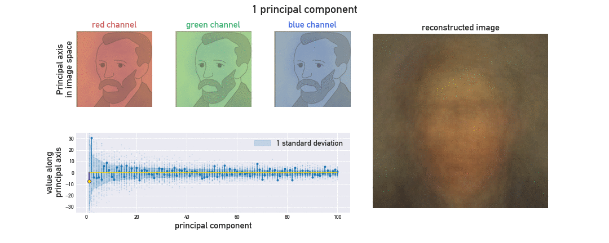

# Principal Component Analysis with van Gogh

**Author**: Jovana Andrejevic

**Affiliation**: Applied Physics PhD Candidate, School of Engineering and Applied Sciences, Harvard University
##

**Artifact:**

**Code:** Please follow [link](code/jovanaandrejevic_code.ipynb) to the code.

### Explanation

#### Introduction
Principal component analysis is a technique in data science that finds an optimal, alternate and often reduced representation of high-dimensional data. Optimal in the context of PCA means that the coordinates of the data in the transformed basis capture the greatest variability in the data.

As a simple example, we can consider a dataset comprised of 2x2 images. In this representation, each image is described by 2x2x3=12 coordinates corresponding to the values of each pixels' red, green, and blue channels. We refer to this as the image basis. The first basis vector in the image basis is:

The set of all twelve basis vectors in this example can be visualized below:

Principal component analysis involves a change of basis; rather than characterizing each image by a set of coordinates representing pixel RGB channels, the image can be suitably represented in a new basis of principal axes, which is typically smaller than the initial number of coordinates. 

Each principal axis is some linear combination of the image basis vectors, formed so that the coordinate of the images along the first principal axis - their first principal component - has the largest variance. The second principal axis is chosen such that the second principal component has the next largest possible variance while maintaining that the second and first principal axes are orthogonal, and so on.

A common application of principal component analysis is dimensionality reduction, as principal components are sorted to express as much variability in the data as possible. We use animation to illustrate how principal component analysis can be used to reconstruct an image with considerably less information needed.

As our test image dataset, we have collected images of Vincent van Gogh's portrait artwork, cropped to a uniform 136x136 pixel region - an image basis of 136x136x3=55488 basis vectors! All images are obtained from [vincentvangogh.org](https://www.vincentvangogh.org/), which hosts a gallery of van Gogh's works.

#### Purpose for animation
1. Our goal is to demonstrate through animation the reconstruction of an image with a limited number of principal components, and visualize its refinement as more components are introduced. The key is to observe that far less information is required to obtain a faithful image reconstruction - only the mean of the image dataset and approximately 100 principal components are required in this example.

2. In addition, we seek to further elucidate the relationship between the image basis and basis of principal axes. Since each principal axis is some linear combination of image basis vectors, we can visualize the projection of the principal axes back onto the image space, and offer a more palpable intepretation of this transformed basis.

3. As noted, the principal axes are chosen such that the variance of the data along each axis is as large as possible. The total variance captured by each principal axis is quantified by the explained variance. We lastly track the cumulative explained variance ratio, whose sum across all principal axes is one, as a metric of how much variability in the data has been accounted for. This quantitative element offers a concise representation of what is observed visually over the course of image reconstruction.