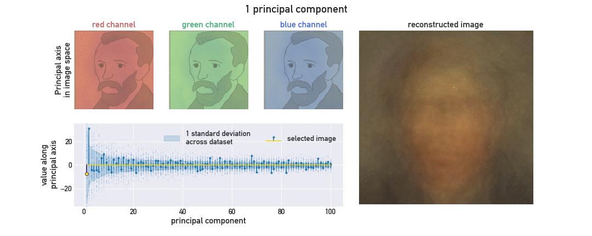

# Principal Component Analysis with van Gogh

**Author**: Jovana Andrejevic

**Affiliation**: Applied Physics PhD Candidate, School of Engineering and Applied Sciences, Harvard University
##

**Artifact:**

**Code:** Please follow [link](code/jovanaandrejevic_code.ipynb) to the code.

### Explanation

#### Introduction
An artist's perception of the world is often through a different lens. Vincent van Gogh, working during the Impressionist Era, rejected the exactness of increasingly popular photography in favor of simpler representations, reducing the subjects of his paintings to their essential features. Produced with coarse, prominent brush strokes or an unconventional color palette, van Gogh's portraits were unmistakably distinguishable, though deliberately different from an exact likeness.

Principal component analysis is much like a view through van Gogh's eyes. By reducing a collection of data only to those features which capture the greatest *variability* across the dataset, it can provide a simpler representation of high-dimensional data.

A common application of principal component analysis is dimensionality reduction, as principal components are sorted to express as much variability in the data as possible. We will use animation to illustrate how principal component analysis can be used to reconstruct an image with considerably less information needed.

As our test image dataset, we have collected color images of Vincent van Gogh's portrait artwork, cropped to a uniform 136x136 pixel region. All images are obtained from [vincentvangogh.org](https://www.vincentvangogh.org/), which hosts a gallery of van Gogh's works.

Principal component analysis involves a change of basis; rather than characterizing each image by a set of coordinates representing pixel RGB values, the image can be suitably represented in a new basis of principal axes, which is typically smaller than the initial number of coordinates. Each principal axis is some linear combination of the image basis vectors, formed so that the coordinate of the images along the first principal axis - their first principal component - has the largest variance. The second principal axis is chosen such that the second principal component has the next largest possible variance while maintaining that the second and first principal axes are orthogonal, and so on.

#### Purpose for animation
In addition to showcasing the reconstruction of an image with increasing number of principal components, our goal through animation is to offer a cohesive view into the building blocks of the reconstruction. In the top left section, a given principal axis is projected onto the image basis to gain insight into the regions most strongly influenced by a principal component along this axis. Below this, we plot the value of our image's corresponding principal component, and highlight the trend in variance of principal components across our dataset. Finally, we show the cumulative image reconstruction on the right. The projection of principal axes and the reconstruction work in concert to portray how early components focus more attention on coarser features such as a broad background or the subject's silhouette, while latter components refine details distributed across the image.

#### References
1. "Vincent van Gogh, his Life and Paintings." Vincent van Gogh Paintings, Drawings, Quotes, and Biography. [https://www.vincentvangogh.org/](https://www.vincentvangogh.org/).

2. VanderPlas, Jake. "In Depth: Principal Component Analysis." Python Data Science Handbook: Essential tools for working with data. " O'Reilly Media, Inc.", 2016. [https://jakevdp.github.io/PythonDataScienceHandbook/05.09-principal-component-analysis.html](https://jakevdp.github.io/PythonDataScienceHandbook/05.09-principal-component-analysis.html).

3. “Sklearn.decomposition.PCA.” Scikit-Learn 0.19.2 Documentation, [scikit-learn.org/stable/modules/generated/sklearn.decomposition.PCA.html#sklearn.decomposition.PCA](scikit-learn.org/stable/modules/generated/sklearn.decomposition.PCA.html#sklearn.decomposition.PCA).

4. Tiao, Louis. “Embedding Matplotlib Animations in Jupyter Notebooks.” Louis Tiao, 16 Apr. 2016, [louistiao.me/posts/notebooks/embedding-matplotlib-animations-in-jupyter-notebooks/](louistiao.me/posts/notebooks/embedding-matplotlib-animations-in-jupyter-notebooks/).

5. Tiao, Louis. “Save Matplotlib Animations as GIFs.” Louis Tiao, 4 Aug. 2016, [http://louistiao.me/posts/notebooks/save-matplotlib-animations-as-gifs/](http://louistiao.me/posts/notebooks/save-matplotlib-animations-as-gifs/).